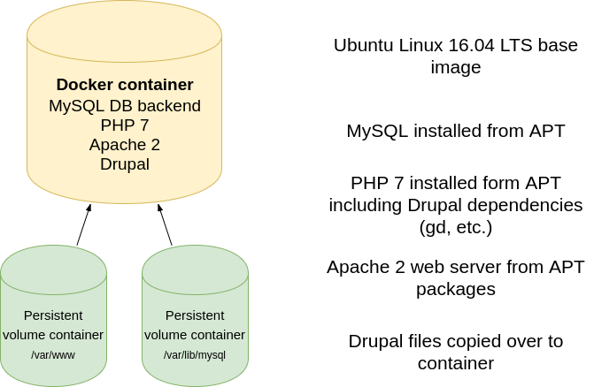

# Implementing a Drupal hosting solution

In this three part document I will outline how to create a hosting platform for Drupal, deploy Drupal using automation, and I will write a simple Ruby application to monitor the status of a Drupal website.

## Creating a LAMP stack machine 

In order to be able to host Drupal one needs a machine/VM/cloud instance with a running webserver, PHP interpreter, and a database backend.
Multiple ways to implement the hosting platform:
- Bare metal Linux machine (not covered in this document)
- Vagrant Virtual Machine
- Single Docker image for the whole LAMP stack + Drupal
- Docker compose set of images running components of the stack

Components of the LAMP stack:
- Apache 2 web server
- PHP 7
- MySQL database

### Vagrant box implementation

LAMP stack machine is a Vagrant VM based on official Ubuntu Xenial image  
Vagrant file for setting up a new VM is present in [vagrant/Vagrantfile](vagrant/Vagrantfile)  
Vagrant VM provisioning shell script can be found in [vagrant/initvm.sh](vagrant/initvm.sh)   


- [Vagrantfile](vagrant/Vagrantfile): creates the Vagrant box, initial config memory, networking, IP address, etc.
- [initvm.sh](vagrant/initvm.sh): provisions Vagrant box, configures user account, deploys python for Ansible
- [install-lamp](ansible/install-lamp.yml): Ansible playbook to deploy the LAMP stack
- [install-drupal.yml](ansible/install-drupal.yml): Ansible playbook to deploy Drupal

Launch and connect to Vagrant box:
```
$ cd vagrant
$ vagrant up
$ vagrant ssh

login credentials
user: vagrant
pass: vagrant
```
Virtual machine IP address (default in the provided Vagrantfile)
```
192.168.33.10
```
IP address can be changed by editing the Vagrantfile [vagrant/Vagrantfile](vagrant/Vagrantfile)

#### Use Ansible to install the LAMP stack over Vagrant

Ansible playbooks for deploying the LAMP stack are in [ansible/install-lamp.yml](ansible/install-lamp.yml)

First edit Ansible inventory file to reflect your machine address [ansible/inventory](ansible/inventory)

```
...
[lamp]
192.168.33.10
# ^^^ change this to your LAMP machine IP address
```

To deploy the LAMP stack, run the provided ansible playbook:
```
$ cd ansible
$ ansible-playbook install-lamp.yml
```

Comments on my playbook:
- python 2 is required for mysql modules
- pip is installed by the playbook
- mysql ansible module is installed by Ansible pip module

TODO: separate playbook functionality into roles

### Single docker container implementation

Custom [Dockerfile](singledocker/Dockerfile) for creating a docker image containing the whole LAMP stack + Drupal



Tweaked Dockerfile [singledocker/Dockerfile](singledocker/Dockerfile)
```
TODO: embed dockerfile here
```

Building the docker image
```
$ cd singledocker
$ docker build -t drupal-single .
```
Running the docker image
```
$ docker run --name=drupal-single -it -p 9980:80 -p 93360:3360 drupal-single

this will run the docker image and publish the web service port on 9980 of the docker machine
Drupal can be provisioned in start.sh
```
Tweak [singledocker/start.sh](singledocker/start.sh) for your deployment configuration 

#### Persistent storage for the single docker container

First create docker volumes

```
docker volume create drupal-files
docker volume create drupal-mysql
```
Run the drupal container with the following command to take advantage of persistent storage 
```
docker run --name=drupal-single -v drupal-files:/var/www/application -v drupal-mysql:/var/lib/mysql -it -p 9988:80 -p 13360:3360 drupal-single 
```

### Docker compose implementation for the whole stack

TODO: separate components into docker images and create a whole stack instance using "docker-compose up"


Component list:
- MySQL instance
- Apache web server + PHP installed and configured (drupal docker image)

### AWS E2C instance implementation

The LAMP stack hosting machine can be an AWS E2C instance (t2.micro is free for testing).


Use Ubuntu xenial AMI as a base for the instance. e.g.

Zone|Name|Version|Arch|Instance Type|Release|AMI-ID|AKI-ID
--|--|--|--|--|--|--|--
eu-central-1|xenial|16.04 LTS|amd64|instance-store|20171121.1|ami-2192104e|aki-184c7a05

Once the AWS E2C instance has been created using AWS web console one can use the Ansible playbook from the first section to deploy the LAMP stack on the machine.

```
$ cd ansible
$ ansible-playbook install-lamp.yml
```
Note: edit [ansible/inventory](ansible/inventory) to reflect your AWS instance IP address and credentials

TODO: AWS screenshots  


## Install Drupal from an Ansible playbook

*This is only applicable to the Vagrant, Bare metal, and AWS implementation as single docker image implementation and docker compose implementation already incorporates installation of Drupal into the docker image(s).*

Ansible script [ansible/install-drupal.yml](ansible/install-drupal) is installing [Drush](https://www.drupal.org/project/drush), and then uses Drush to deploy our Drupal site.

To deploy Drupal, run the provided ansible playbook:
```
$ cd ansible
$ ansible-playbook install-drupal.yml
```

## Ruby application for monitoring a Drupal stack

### Part 1: Testing a drupal site (service level ping)

A Ruby REST web application implemented using Sinatra to test a Drupal site for response code/content.  

A site is considered live when:
- HTTP GET request returns status code 200 OK
- Retrieved content matches a pre-defined pattern

### Part 2: Bringing the site up/down on AWS

Ruby script can start/stop the instance  
TODO: this needs access to AWS, using AWS SDK - unable to test

In the following Ruby code is used to start an AWS instance:
```
require 'aws-sdk-ec2'  # v2: require 'aws-sdk'

def startinstance instancename
	ec2 = Aws::EC2::Resource.new(region: 'eu-central-1')
	i = ec2.instance(instancename)

	if i.exists?
		case i.state.code
		when 0
			# pending, do nothing (wait)
		when 16
			# already started
		when 48
			# terminated, can not start
		else
			i.start # stop it!
		end
	end
end

```
To stop an AWS instance:
```
require 'aws-sdk-ec2'  # v2: require 'aws-sdk'

def stopinstance instancename
	ec2 = Aws::EC2::Resource.new(region: 'eu-central-1')
	i = ec2.instance(instancename)

	if i.exists?
		case i.state.code
		when 48
			# terminated, do nothing
		when 64
			# stopping, do nothing (wait)
		when 80
			# stopped, again, do nothing
		else
			i.stop # stop it!
		end
	end
end

```
TODO: return codes, for every case


# Links, references

- [Readme driven development](http://tom.preston-werner.com/2010/08/23/readme-driven-development.html)
- [Jeff Geerling's excellent ansible roles](https://github.com/geerlingguy/ansible-role-drupal)
- [Amazon E2C AMI locator](https://cloud-images.ubuntu.com/locator/ec2/)
- [Drush to install Drupal](https://www.drupal.org/project/drush)
- [ZopNow LAMP on docker](https://hub.docker.com/r/zopnow/lamp-stack/)
- [Drupal in dockerhub](https://hub.docker.com/_/drupal/)
- [DrupalVM: if you want to do the whole project in one shot](https://www.drupalvm.com/)
- [Docker data container volumes](https://medium.com/@rasheedamir/docker-good-bye-data-only-container-pattern-a28f90493a5a)


